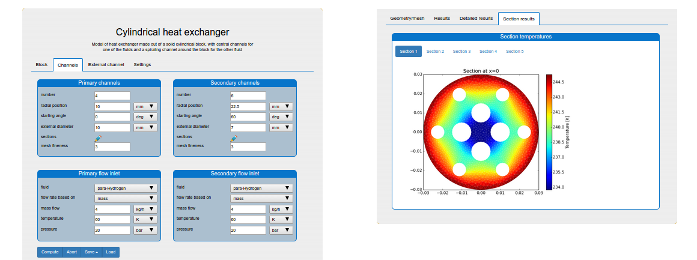
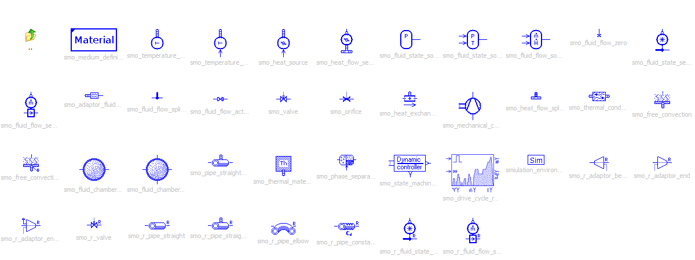

# Projects

## [Flowmbed](https://github.com/SysMo/flowmbed)

A framework (written in Rust) for code generation for microcontrollers. It provides:

  - declarative configuration of MCU and peripherals, using yaml files
  - support for various peripherals using device independent logic
  - building control logic using reusable blocks (similar to Simulink, Modelica)
  - strong separation of control logic and system code
  - currently generates Rust for ESP32 with IDF, but can easily be ported to other languages and devices 

## [QuartzBio](https://www.quartz.bio/)

Cloud framework for managing clinical and biomarker data.

## [SmoWeb Platform](http://platform.sysmoltd.com/)

Online platform for modeling and simulation. The platform contains a number of models in the fields of thermodynamics, heat and mass transfer and bio-reactor modeling. It was used by BMW AG and some research groups at the Bulgarian Academy of Sciences

Links:
  - [Site](http://platform.sysmoltd.com/)
  - [Github](https://github.com/SysMo/SmoWeb)

## SmoFlow

A C++ library for computations and simulations of heat transfer and fluid flow. Uses CoolProp library for computing fluid properties over a wide range of temperature and pressure in gas, fluid and 2-phase regime.
