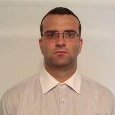

# Team

## Atanas Pavlov

Interests:
  - Full stack development
  - Model based software development, metaprogramming, code generation
  - Data analytics, machine learning, neural networks
  - Engineering simulations
  - Embedded devices

Links:
  - [Linkedin](https://www.linkedin.com/in/atanas-pavlov-7147521a/)
  - [Toptal](https://www.toptal.com/resume/atanas-pavlov)

## Dimitar Dimitrov

Interests:
  - Front-end development
  - UX/UI
  - Functional programming
  - Metaprogramming

Links:
  - [Linkedin](https://www.linkedin.com/in/dimitar-dimitrov-02954342/)
  - [Toptal](https://www.toptal.com/resume/dimitar-dimitrov)

## Milen Borisov

Interests:
  - Modeling systems with fluid flow & heat exchange
  - Modeling biological systems and processes

Links:
  - [Linkedin](https://www.linkedin.com/in/milen-borisov-a6797128/)
  - [Toptal](https://www.toptal.com/resume/milen-kolev-borisov)

## Evtim Kilifarev

Interests:
  - Embedded systems

Links:
  - [Linkedin](https://www.linkedin.com/in/evtimkilifarev/)

## Hristo Radoev

Links:
  - [Linkedin](https://www.linkedin.com/in/hristo-radoev-138721141/)
