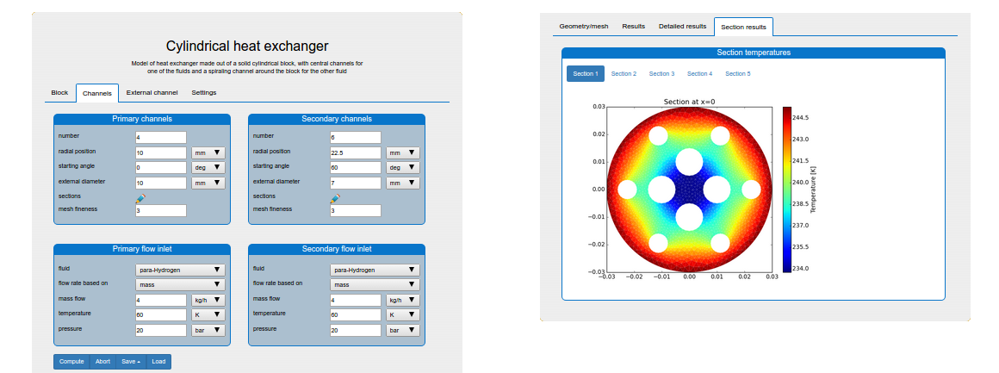

# About us

## Expertise

## Projects

### [Flowmbed](https://github.com/SysMo/flowmbed)


{{ hello }}

### QuartzBio 

### SmoWeb Platform

Developed an online platform for modeling and simulation. The platform contains a number of models in the fields of thermodynamics, heat and mass transfer and bio-reactor modeling. It was used by BMW AG and some research groups at the Bulgarian Academy of Sciences

## Team

### Atanas Pavlov

Links:
  - [Linkedin](https://www.linkedin.com/in/atanas-pavlov-7147521a/)
  - [Toptal](https://www.toptal.com/resume/atanas-pavlov)

### Dimitar Dimitrov

Links:
  - [Linkedin](https://www.linkedin.com/in/dimitar-dimitrov-02954342/)
  - [Toptal](https://www.toptal.com/resume/dimitar-dimitrov)

### Milen Borisov

Links:
  - [Linkedin](https://www.linkedin.com/in/milen-borisov-a6797128/)
  - [Toptal](https://www.toptal.com/resume/milen-kolev-borisov)
